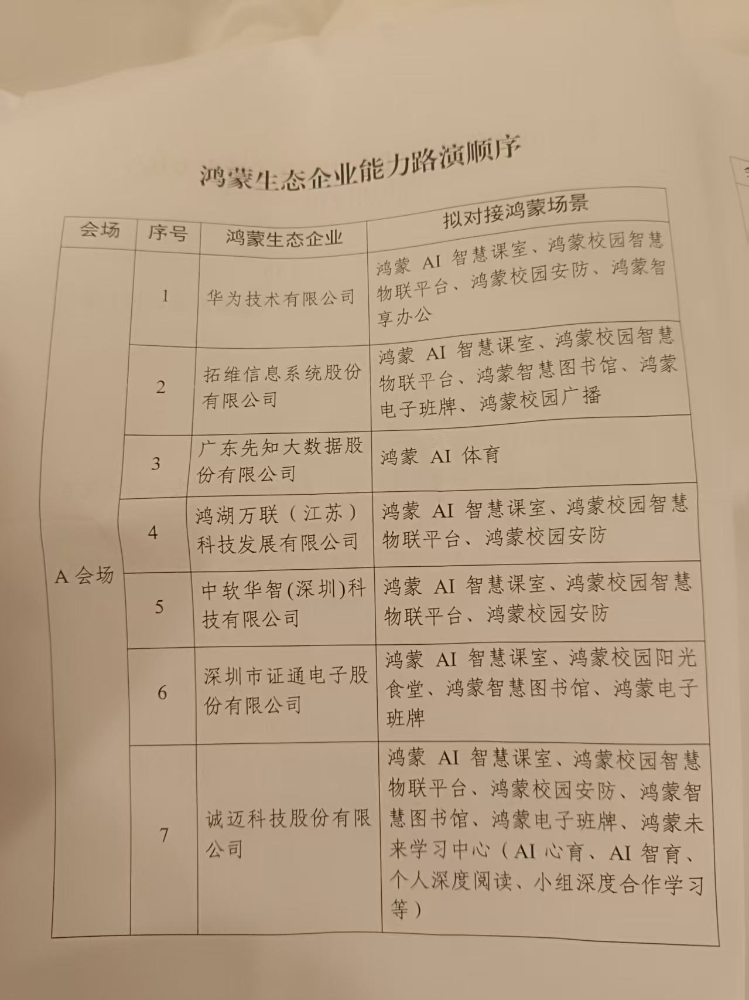
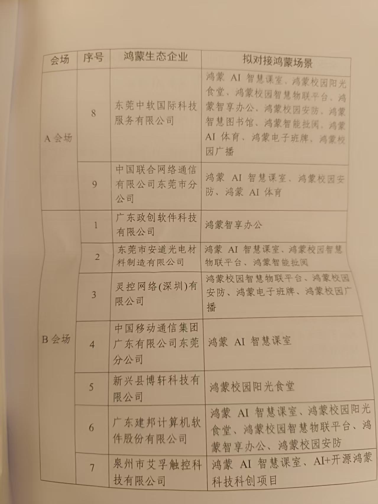
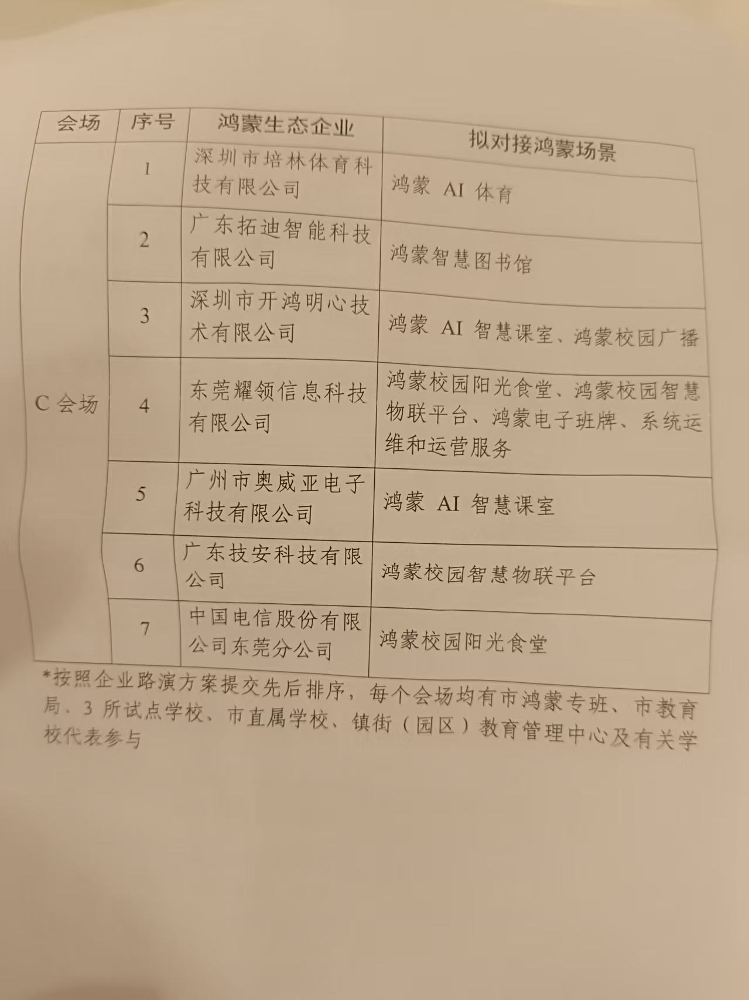

# 7月30日 · 旁听日程

> 旁听学习，重点了解鸿蒙在教育行业的落地情况。

---

## 基本信息

| 项目 | 内容 |
|------|------|
| **会议** | 东莞市鸿蒙场景供需对接会（教育专场） |
| **时间** | 7月30日（周四）14:30 — 17:30 |
| **地点** | 东莞市松山湖园区 · 东莞科创金融广场C栋1楼 |
| **主办** | 东莞市"鸿蒙之城"建设攻坚工作专班、东莞市教育局、东莞市发改局 |
| **角色** | 旁听学习 |

---

## 会议议程

活动议程.jpg)

---

## 会议背景

东莞2026年将"建设开源鸿蒙生态城市"列为十大亮点工作之一。本次教育专场对接会，旨在推动鸿蒙在校园场景的落地。市教育局已初步形成鸿蒙智慧校园"**1+3+N**"全域协同试点方案（1个市级教育数字基座 + 3所标杆试点校 + N个创新应用场景）。

简单说就是——让做技术的人和用技术的人面对面聊，看看鸿蒙在学校里到底能干什么。

---

## 企业路演顺序

---

## 旁听关注点

### 👂 重点听什么

1. **学校端的真实需求是什么？** 四个场景（智慧图书馆、物联平台、电子班牌、智能批阅）各自解决了什么痛点？
2. **企业怎么"推销"自己的方案？** 各家的差异化卖点和技术亮点在哪？
3. **对接机制怎么运作的？** 东莞市应用场景创新中心、"东莞场景服务"小程序是怎么撮合供需的？

### 📝 记什么

- 企业提到最多的关键词（如"分布式软总线""碰一碰""AI Agent""数据基座"）
- 学校代表提问的侧重点（更关心价格？安全？还是易用性？）
- 有没有当场达成的合作意向或后续安排

---

## 时间线

| 时间 | 内容 |
|------|------|
| 14:00 | 提前到场，熟悉会场 |
| 14:30 | 会议开始，政策与方案介绍 |
| 15:00 左右 | 企业路演（9家企业轮流展示） |
| 16:30 左右 | 学校需求发布 + 供需对接交流 |
| 17:30 | 会议结束 |

> 具体时间以现场议程为准。

---

## 参会企业速览（9家）

1. **华为** — 鸿蒙生态核心推动者
2. **先知大数据** — 鸿蒙科学运动方案（体育课堂）
3. **诚迈科技** — 鸿蒙全场景智慧校园（信创底座），深圳清水河学校案例
4. **中国联通** — 联鸿OS + 5G专网 + 国家级中试基地
5. **中软国际** — AI Agent赋能安防/通行/会议/运维
6. **拓维信息** — "1+2+N"开鸿智慧校园 + 电子学生证"碰一碰"
7. **鸿湖万联** — N+4+1模式 + L1-L5课程体系
8. **证通电子（证开鸿）** — 智慧食堂 + AI课室 + 智慧图书馆
9. **中软华智** — SmartEOS教育操作系统 + 教育部联合实验室

---

## 备注

- 本次为旁听学习身份，不参与正式对接环节
- 重点积累鸿蒙+教育的案例素材，为后续调研报告做准备
- 会后整理一份简要的观察笔记

> 2026年7月30日，松山湖
