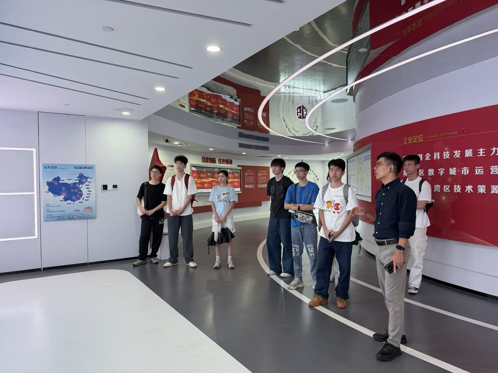
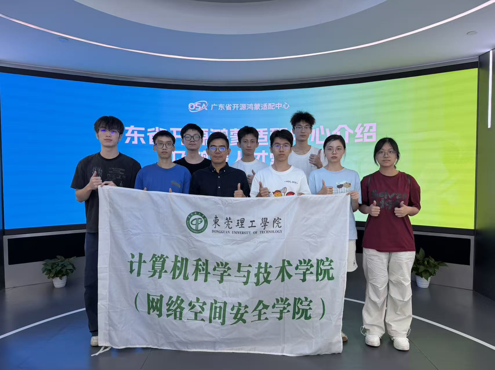
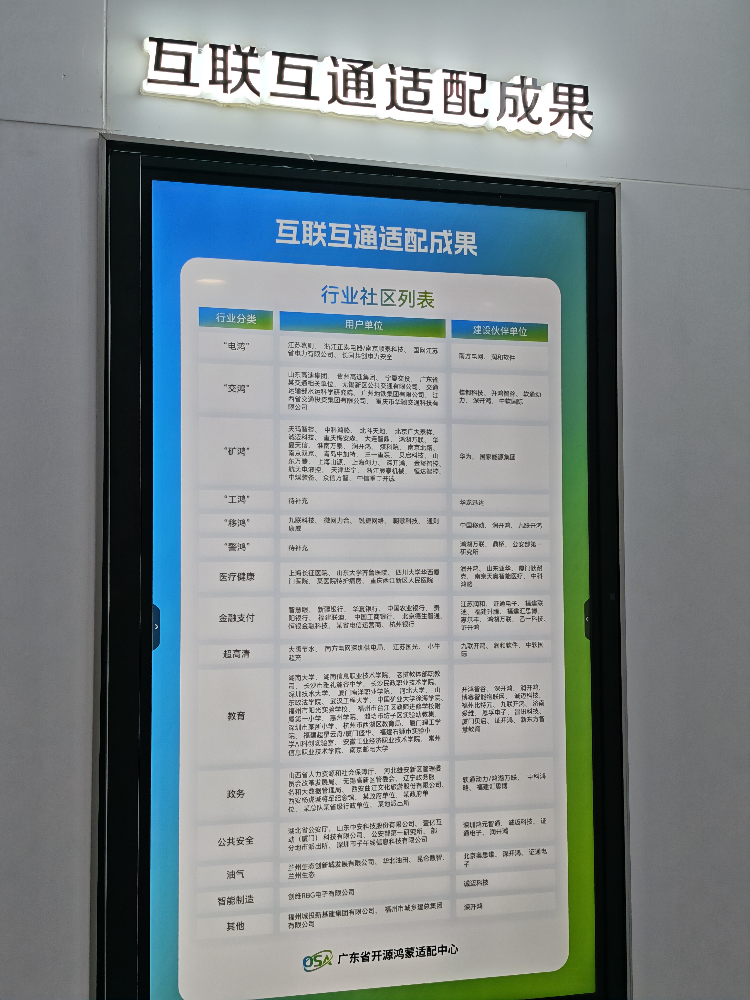
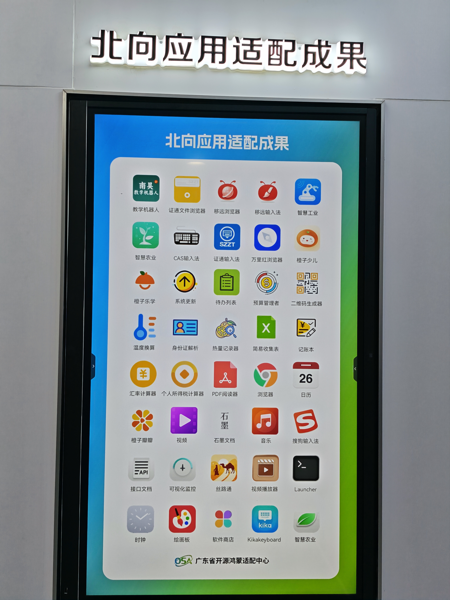
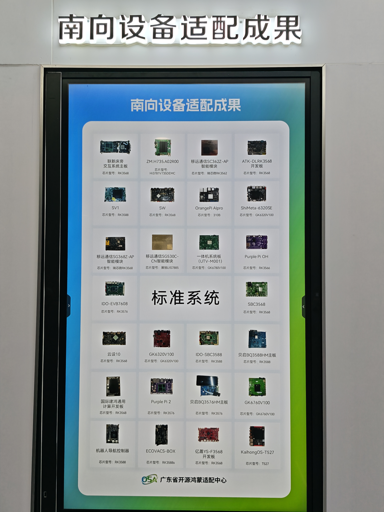
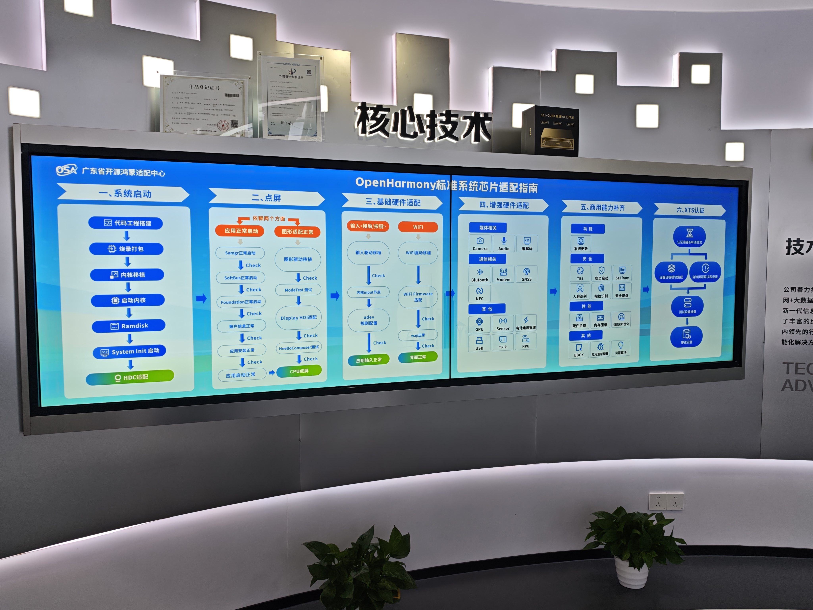
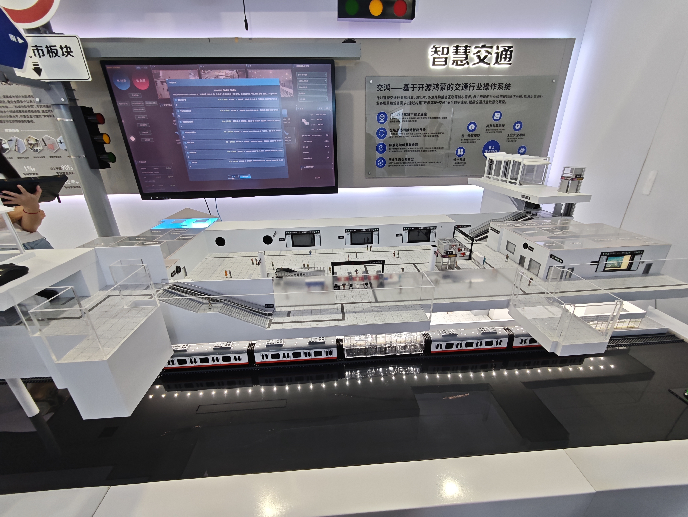
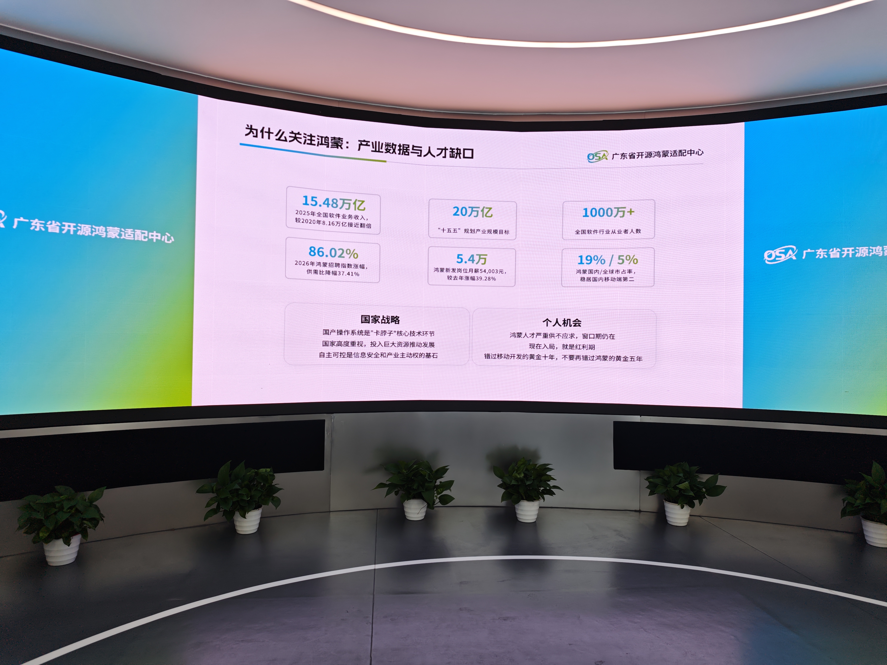
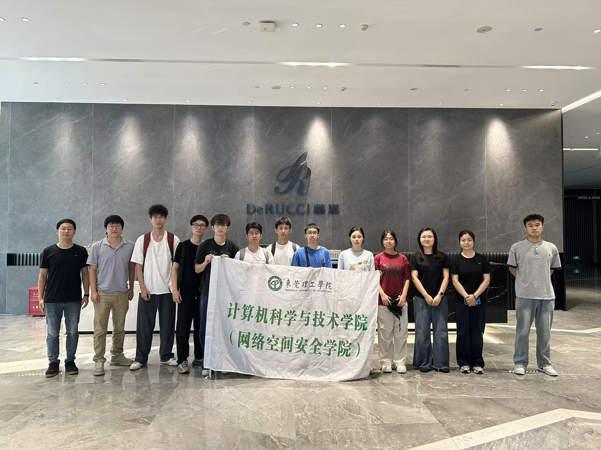

# 7月29日实践心得

今天我们团队外出调研，下午去广州黄埔的广东省开源鸿蒙适配中心和东莞厚街的慕思健康睡眠股份有限公司。一个下午跑两个城市，很累，但也有所收获。

---

## 一、省适配中心：从"听过"到"看到"

之前对"开源鸿蒙适配中心"这个概念一直比较模糊，只知道是个做技术认证的地方。直到今天走进展厅，听负责人详细讲解，才真正理解了它的定位——用负责人的话说，就是全省开源鸿蒙生态的"服务方"。其主要职能为:鸿蒙全栈适配/测试认证/工具链/人才培训/生态招商,是公益属性、与企业化运作。

"一中心+三基地"布局。广州、佛山、东莞三地协同，湛江也有在筹建基地，投资总共超过1亿元，不是各自为政，而是有明确的分工和联动机制。运营模式也很有意思——科学城数科集团牵头，佳都科技、电子五所、华为协同参与。

在展厅里，有几块展板：

**北向应用适配成果**——展示了各种鸿蒙原生应用的实际运行效果，从简单的工具类APP到复杂的行业应用都有覆盖。

**南向设备适配成果**——各种芯片、模组、开发板的适配情况一目了然。

还有一个细节我很感兴趣——**OpenHarmony标准系统芯片适配指南**。从这里能看到从芯片层到系统层的完整适配流程，确实是一个不错的技术体系。

展厅里"深圳鸿蒙地铁站"的案例让人眼前一亮——"交通佳鸿"OS已经在地铁线路规模化部署了。以前觉得鸿蒙离日常生活很远，看到它在交通这种基础设施中的实际应用，感觉鸿蒙正在慢慢融入生活中来。

这组**产业数据与人才缺口**的数据表明生态发展得很快，但人才供给明显跟不上，供需也出现了错位。

---

## 二、慕思：当床垫"学会"了鸿蒙

到了慕思，第一印象就是这家公司和我想象中不一样。原本以为就是一家做床垫的传统制造企业，但从公司大楼到展厅布置，科技感很强。

最让我震撼的是一组数据：鸿蒙智能床累计销售额超亿元，占智能床销量的40%。一个床垫品牌，靠接入鸿蒙生态做到了这个成绩，确实刷新了我对"传统企业数字化转型"的认知。

这个是昨天在国贸在现场看到了他们的鸿蒙智选产品——床垫不只是床垫了，更像一个"睡眠中枢"。通过鸿蒙智联，它能跟房间里的灯光、空调、窗帘联动。比如说你躺下后，灯光自动调暗、空调调到睡眠模式、窗帘缓缓拉上——这些都是自动完成的，不需要掏出手机一个一个点。

在交流中，我问了一个我很关心的问题：数据隐私。慕思积累了百万级人体工学数据和十亿级睡眠大数据，这些数据的价值不言而喻，但用户凭什么信任你把数据交给一张床？他们介绍了一些隐私保护机制，虽然不能说完美，但至少说明企业在认真对待这个问题。毕竟，没人愿意自己每天几点睡、翻了几次身、心率多少都被拿去做分析——哪怕是匿名的。

---

## 三、写在最后

今天最大的收获是把"自主可控操作系统"这个概念变成了亲眼所见的东西。

从省适配中心到慕思，其实是一条完整链条：前者解决"能不能做"的问题（标准、认证、人才），后者回答"做出来有没有人要"的问题（产品、市场、商业模式）。两者的关系不是上下游，而是共同构成了生态。

晚上回到住处翻看今天的照片和笔记，想起负责人说的那句"鸿蒙不是某一家公司的操作系统，而是整个产业的公共品"——这句话大概是我今天最大的收获。作为一个还在学专业课的学生，这个思想也许会在我未来处理一些事物的时候受其影响。

> 2026年7月29日，记于广州→东莞调研归来
