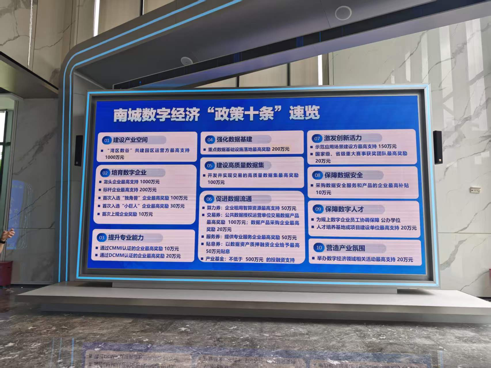
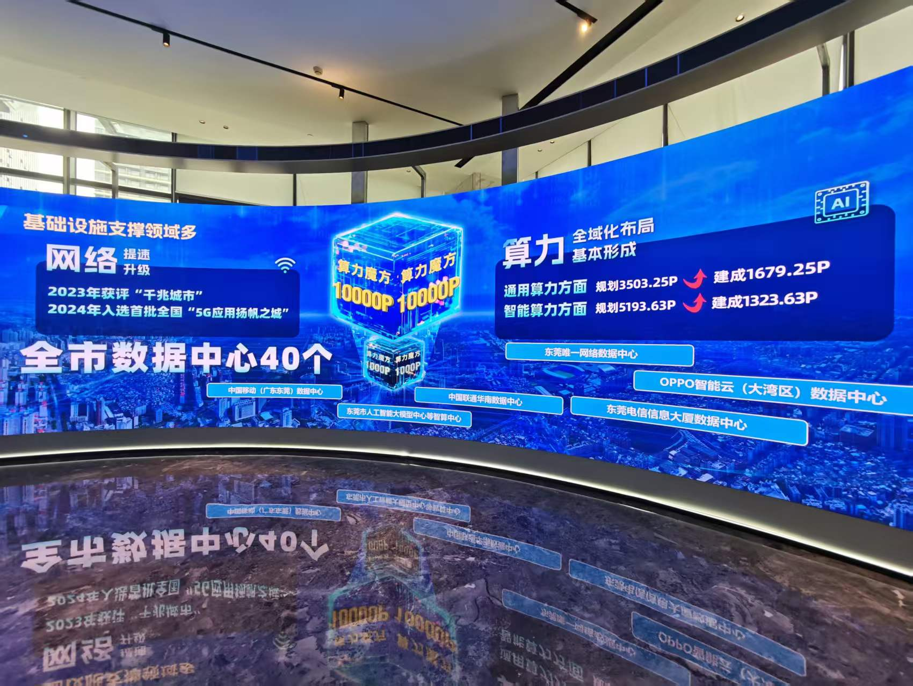
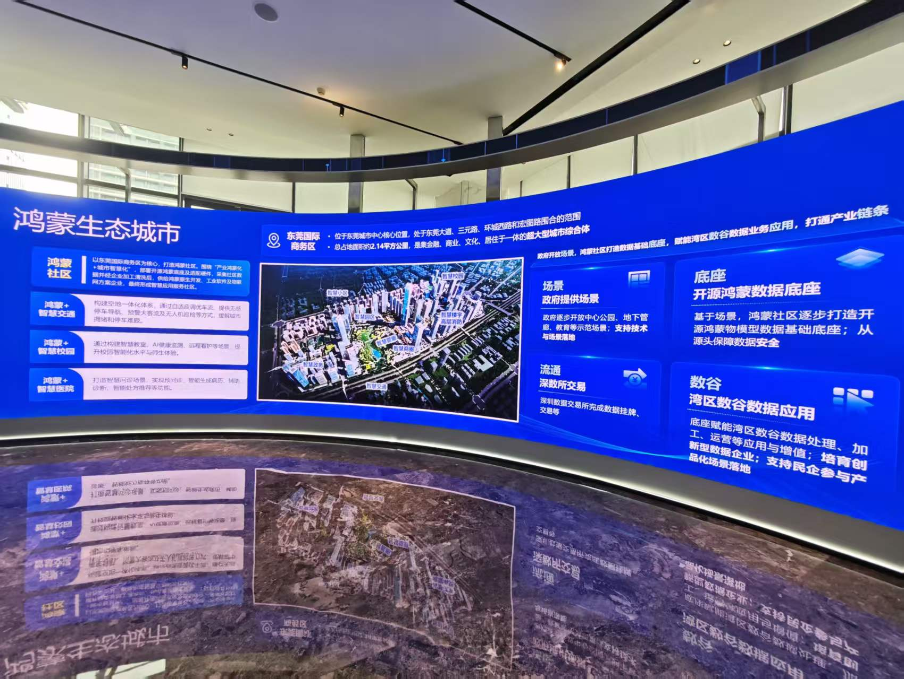
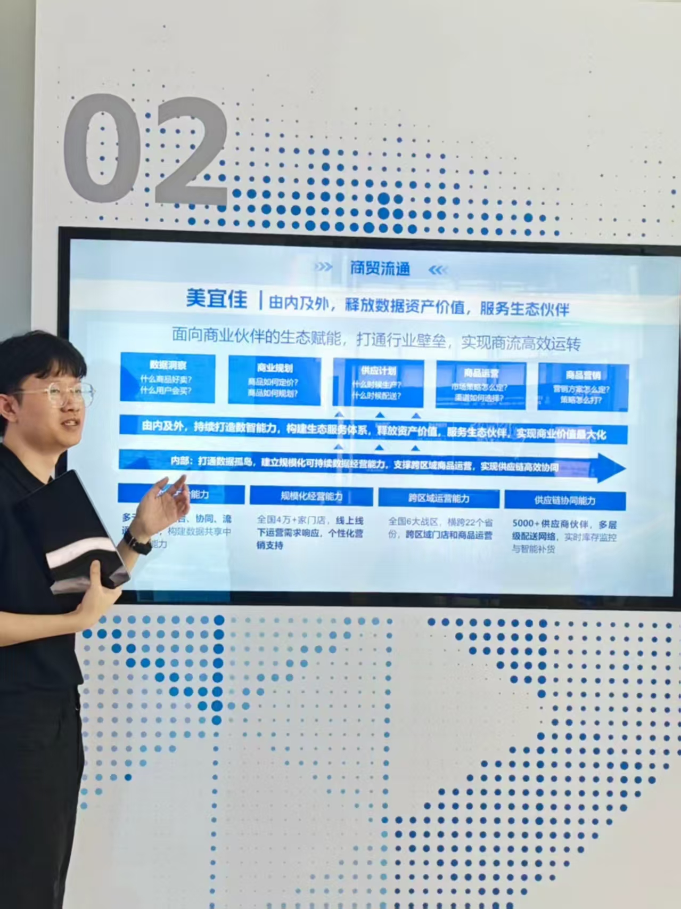
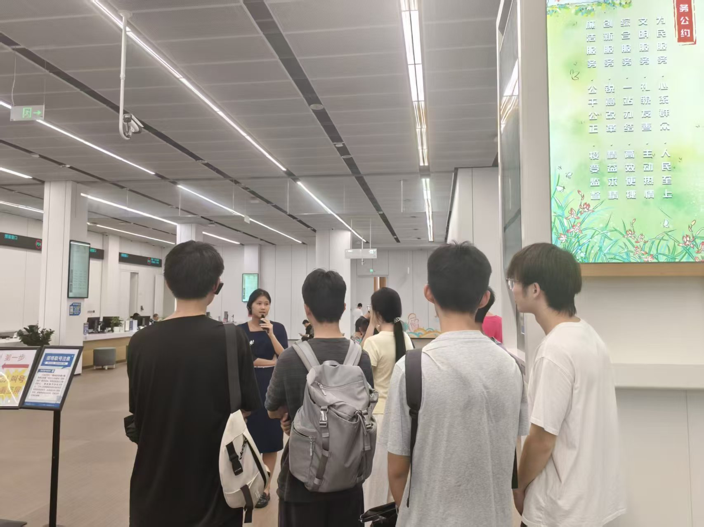
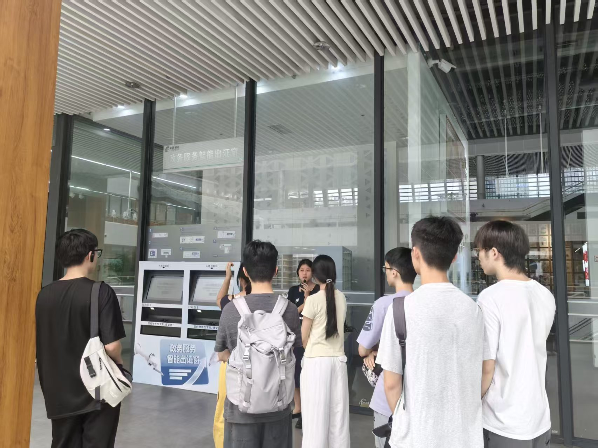
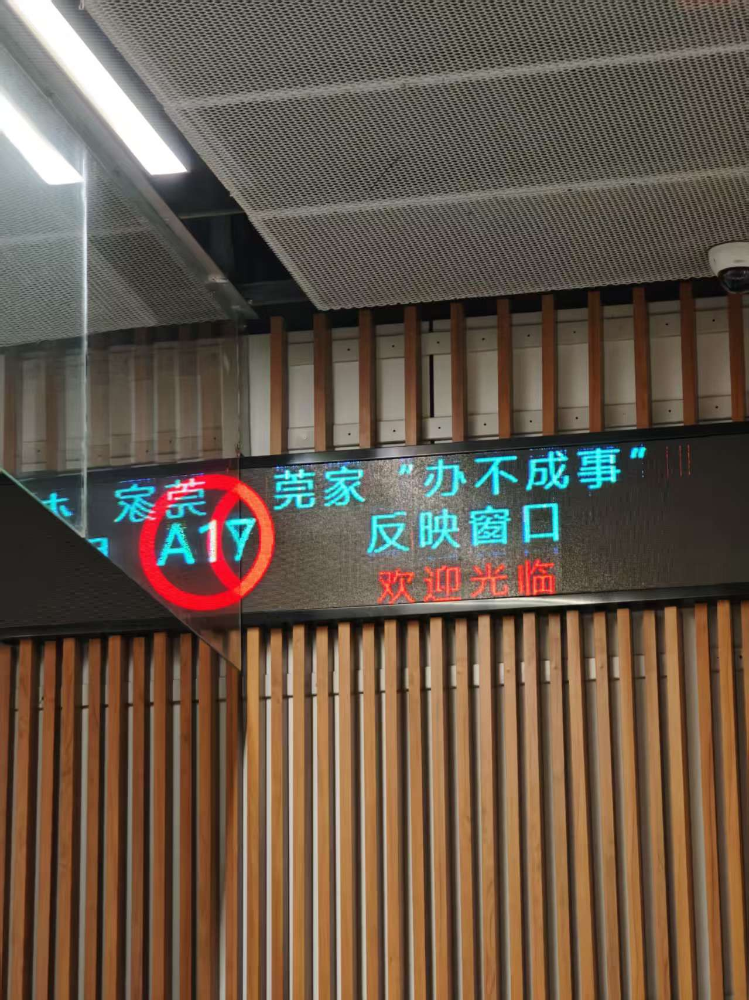

# 7月31日实践心得

不管是上午看的湾区数谷产业园还是下午看的市民中心，可以看到政策的框架已经搭起来、企业也有开始入驻、政务场景也有首批上线了——看起来热火朝天。但细看会发现，真正跑通的东西还不多，鸿蒙的规模化应用也就是近一两年才开始，不少场景、地方还在试水中，距离成熟的规模化运转还有一段路要走。

---

## 一、上午 · 湾区数谷

我们看到南城数字经济"政策十条"，把数字经济这个产业做完善、做规范。这意味着南城在数字经济的招商引资、企业培育、人才引进、数据交易等各个环节都有了明确的制度安排，不是零散的政策，而是一套完整的框架。我们了解到不仅这个产业园在做数字经济，在东莞其他镇区，全国都有公司和企业在做数字经济，政府在逐步规范与完善这个行业的框架。

东莞在"人工智能、新型存储、新一代信息、工业母机、未来食品"五个领域计划研发投入总额8.3亿元。可以看出东莞的布局不是只盯着某一条赛道，而是在多个前沿方向同时下注，试图形成一个相互支撑的产业矩阵。

全市的数据中心有40个，数据存储规模是按P算的，比课堂里学的存储要大，而且大得多，我们课程实验代码里处理的数据在这里根本微不足道。在学校里写代码，一个GB级别的数据我们同学就觉得不小了，但到了产业层面，数据的量级是PB甚至更高，完全是另一个概念。有感:课堂上学的数据结构和算法是基础，到了产业应用中，还要面对分布式存储、实时计算、数据治理、政策结合这些课堂上很少触及的问题。

东莞想要打造鸿蒙生态城市，通过鸿蒙社区、鸿蒙+智慧交通、鸿蒙+智慧校园、鸿蒙+智慧医院这些项目来推进。这些都是已经在进行中的事情，不是规划图上的概念。结合7月30号参加的供需对接会来看，有企业在响应、有市场在买单，说明这项政策确实在一步步的推动落地。

负责人举了一个美宜佳的例子，带我们全链路了解了数据的流转过程以及数据的重要性。他说，门店在哪个时间段、哪种牛奶卖得多——看似简单的销售记录，背后可以挖掘出很多信息。比如供应商可以根据这些数据在某个时段多产出某些产品，优化供应和运货的成本；品牌方可以根据不同区域的消费偏好，调整铺货策略和促销方案；甚至整个供应链的库存周转效率都能因此提升。这个例子说明数据不只是"记录"，更是一种可以反复利用的生产资料。一个牛奶货架的销售数据，串起了从供应商到品牌方到零售终端的整条供应链——数据的价值，正是在这种跨环节的流动中被放大的。

而且数据本身可以发生买卖，在合规的框架下进行交易流通，成为新的经济增长点。但与此同时，政府在推动数据流通之前，需要先出台规范来划定边界：哪些数据能卖、哪些涉及隐私和安全不能卖、交易过程中谁来监管、出了问题怎么追责——每一个环节都需要有明确的规范和红线。没有规则的数据流通不是市场，是乱象。

总结下来，数据的作用可以体现为数据洞察、商业规划、供应计划、产品运营、商品营销等多个方面，而政府的角色是在"促进流通"和"守住底线"之间找到平衡。

---

## 二、下午 · 市民服务中心

下午三点到达市民服务中心，第一印象是安静——没有想象中政务大厅的嘈杂和吵闹，这让人有些意外。厅内宽敞舒服，几乎每个窗口都有工作人员在给市民解决问题，一切都在有序运转。市民脸上没有太多不耐烦的情绪，一些人走得比较快，可能是在赶着办事，一些人在等候区安静地休息。

工作人员给我们每人发了耳机，她通过麦克风讲解，这样我们听得清楚，也不会让大厅内太吵，很细节。她逐步带我们介绍了几个主要的办事区域，并告诉我们，窗口前有人接待，窗口后面还有专门的房间为市民处理更复杂的问题——前台的窗口只是办事链条的第一环。

然后她带我们到了鸿蒙AI智办体验区。我以为只有鸿蒙手机才能用这个区域，负责人告诉我们，这个台是所有手机都能办的，但如果使用鸿蒙手机，就能用到鸿蒙的一些特性，会更加方便快捷。接着她用鸿蒙手机带我们完整看了一遍AI办事流程：只用轻轻一靠，她的信息就自动上传到了屏幕上，不需要手动输入账号密码或者扫码登录——这是当天让我印象最深的一个点——因为它解决的不是一个大问题，而是一个高频的小麻烦：每次办事都要反复登录、填信息，碰一下全跳过了。传文件也是用鸿蒙的"碰一碰"特性完成，省去了找文件、选路径、上传这些步骤，整个流程很顺畅。

AI办事的后台连接的是政务知识库，这保证了内容的可靠性——跟我们课程里学的RAG（检索增强生成）有些关系，相当于AI不是凭空生成答案，而是从权威的政务数据库里检索后再输出。如果遇到AI解决不了的问题，这个台还会有专员来介入处理，不是完全交给机器。另外注意到，除了鸿蒙体验区，市民中心室内外都部署了一些自动化办事的机器，说明智能化不只是鸿蒙专区的事，整个大厅都在往自助化方向走。

体验下来，便捷和安全确实是鸿蒙主打的两个方向。这些特性是不是只有鸿蒙能做？从技术上说，NFC碰一碰、跨设备流转这些功能，其他系统未必不能实现。但政府选择鸿蒙，可能不只是技术层面的考量——在多品牌多设备的数据治理上，国产自主操作系统可以有更多主动权；一些国外操作系统在授权和数据调用上受到各种限制，而通过鸿蒙这个国产平台，政务场景里很多事情可以做得更深入。所以从市民服务中心出来，我更多在想：政府需要一个自主可控的底层系统来承载政务数字化，鸿蒙也需要真实的大规模应用场景来打磨自己——两边不只是采购关系，而是互相成就。

---

## 三、最后

7月31日这一天，上午看湾区数谷、下午看市民服务中心，给我的感受是：鸿蒙生态的推进不是单一系统的事，而是需要上下游同时发力、多方面多细节地去落地。

上午看到的是"上游怎么做"——政策如何搭框架、资金往哪里投、数据基础设施建到什么程度。但光有政策和设施不够，还需要有人用。美宜佳的例子让我看到，数据真正的价值不在于存储量有多大，而在于能不能在具体的商业场景里用起来——优化供应链、指导营销、辅助决策。而这又反过来要求政府划定数据交易的规则和红线，没有规则，数据的流通就是空谈。

下午看到的是"下游怎么用"——鸿蒙进了政务大厅，市民能不能真的感受到方便。碰一碰登录、碰一碰传文件，这些功能在技术上不算颠覆性创新，但放在政务办事这个具体场景里，确实能省掉不少繁琐的步骤。不过更让我注意的是，这个AI智办区不只是给鸿蒙手机用的，所有手机都能办，鸿蒙只是多了一些便捷特性。这说明政府在做的是先把服务跑通，再逐步发挥鸿蒙的优势，而不是强行捆绑。

上下游两手抓，说起来简单，但实际涉及的东西非常杂：政策制定、技术认证、产业招商、数据治理、用户体验、隐私保护……每一个环节都有大量细节要处理，需要政府大胆去推行，去实践后纠正，不断调整，需要公司企业积极去尝试和调整，共同解决问题，而不是等着事情自然发生，这个需要有同一个信念和走的起来的驱动力，有统一协调的步调。鸿蒙生态也不是单个部分厉害就能成的——得上游的政策、技术、数据和下游的场景、产品、体验，每一环都跟上，缺了一块就“办不成事”。

> 2026年7月31日，记于南城调研归来
